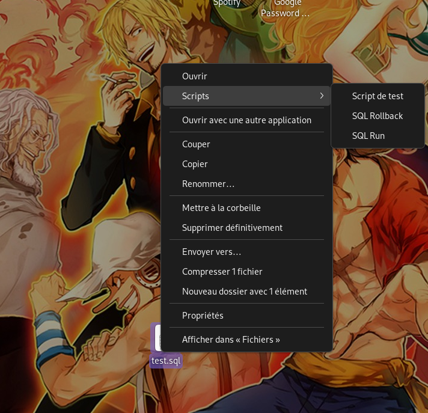

# nautilus-scripts/sql-run
> Création d'un executable go qui permet de lancer un fichier sql au clic droit sur celui-ci grâce à Nautilus Scripts

## Pre requis
- Installer un serveur de base de données MySQL ou Postgres
    - Si vous installez un serveur de base de données Postgres, changez `/* Database: MySQL */` par `/* Database: PostgreSQL */`

---
## Installation avec build
> La dernière version du script build sous forme d'un executable est disponible à la racine du répository pour celles et ceux qui ne souhaitent pas faire le build eux même.

```bash
go build -o "~/.local/share/nautilus/scripts/<executable script>"
```
> Prenez en compte que le nom complet de l'executable sera utilisé pour être affiché dans le menu contexutel.



## Installation sans build

```bash
cd <repository name>
cp "./SQL Run" "~/.local/share/nautilus/scripts/<executable script>"
```
